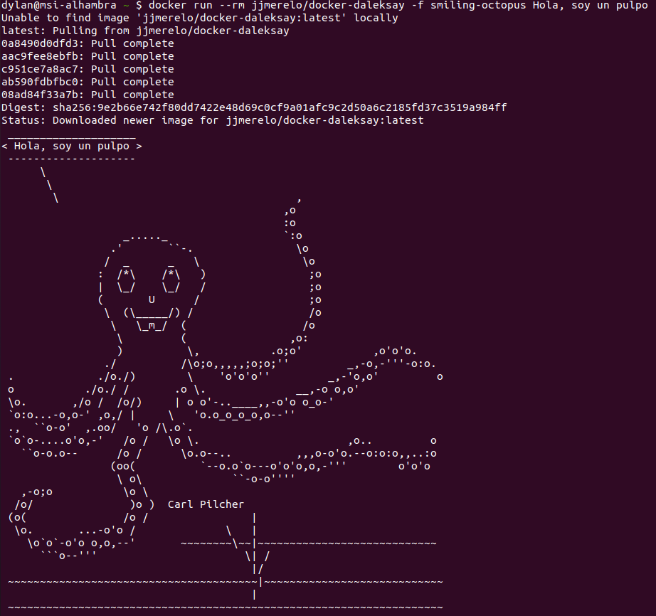
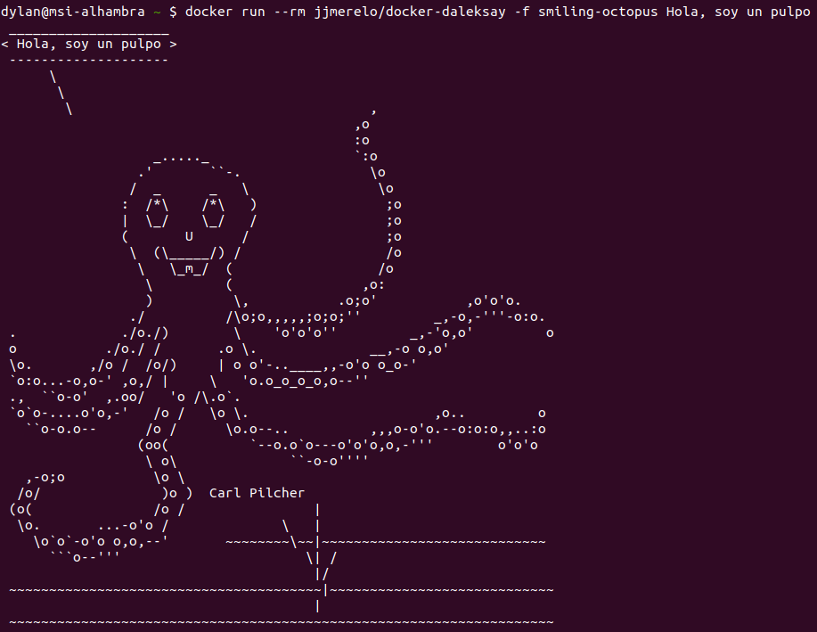

# Ejercicios tema 3 parte 1

## Ejercicio 1

**Buscar alguna demo interesante de Docker y ejecutarla localmente, o en su defecto, ejecutar la imagen anterior y ver cómo funciona y los procesos que se llevan a cabo la primera vez que se ejecuta y las siguientes ocasiones.**

Primero he instalado *Docker* en *Ubuntu 20.04* siguiendo [este tutorial](https://www.digitalocean.com/community/tutorials/how-to-install-and-use-docker-on-ubuntu-20-04-es). A continuación, he seguido [las instrucciones indicadas en el tema](https://docs.docker.com/engine/install/linux-postinstall/#manage-docker-as-a-non-root-user) para usar el cliente desde un usuario sin privilegios.

Una vez completada la instalación, he probado el ejemplo anterior:

```
docker run --rm jjmerelo/docker-daleksay -f smiling-octopus Hola, soy un pulpo
```

Este es el resultado la primera vez que se ejecuta:



Si ahora intentamos ejecutar la imagen por segunda vez:



Como podemos ver, la primera vez que ejecutamos la imagen, no está localmente. Esto quiere decir que necesita descargarse. Sin embargo, la segunda vez que utilizamos el comando sí se encuentra ya en el sistema, con lo que se ejecuta directamente sin necesidad de ninguna descarga.

## Ejercicio 2

**Tomar algún programa simple, “Hola mundo” impreso desde el intérprete de línea de órdenes, y comparar el tamaño de las imágenes de diferentes sistemas operativos base, Fedora, CentOS y Alpine, por ejemplo.**

He instalado imágenes de *Fedora*, *CentOS* y *Alpine*. Para ello, he usado:

```
docker pull alpine
docker pull fedora
docker pull centos
```

A continuación, para ver todas las imágenes instaladas, he usado `docker images`, obteniendo la siguiente imagen:


Podemos observar que los tamaños de *Fedora* y *CentOS* rondan los 200 MB, mientras que *Alpine* ocupa algo más de 5 MB. Además, si comparamos el tamaño de *Alpine* con el *hello-world* o con la aplicación del ejemplo anterior, vemos que sigue siendo más pequeño. Se trata, pues, de una imagen muy ligera, lo cual puede resultar muy beneficioso en cuanto al reducido espacio que ocupa y la velocidad de descarga.

## Ejercicio 3

**Crear a partir del contenedor anterior una imagen persistente con commit.**

Voy a crear una imagen persistente de *Alpine*. 

Las imágenes instaladas inicialmente son: 


Primero ejecuto la imagen de *Alpine*, creando un nuevo contenedor. En este contenedor accedo al *shell* y genero un archivo hola-mundo.txt que contiene la palabra "Hola" en el directorio prueba.


A continuación, compruebo los contenedores existentes con `docker ps -a`.


Para crear una nueva imagen a partir del estado de este contenedor, utilizo *commit* con el id.


La nueva imagen se llama nuevo-alpine. Vemos cómo ahora, al hacer `docker images`, encontramos tanto la imagen inicial de *Alpine* como la que acabamos de crear.


Por último, ejecuto la imagen del nuevo-alpine y compruebo que existe el archivo hola-mundo.txt en el directorio prueba y que contiene "Hola". Esto indica que el estado del contenedor anterior se ha guardado correctamente en esta imagen.


## Ejercicio 4

**Examinar la estructura de capas que se forma al crear imágenes nuevas a partir de contenedores que se hayan estado ejecutando.**

Ejecuto el comando `jq`sobre la imagen guardada en el ejercicio anterior (nuevo-alpine).

```
sudo jq '.' /var/lib/docker/image/overlay2/imagedb/content/sha256/a92f4789360d61fde64b240f6f875c978656e729b95fc3f1f792213a75f3b9e8

```

Se obtiene una estructura de dos capas: la imagen inicial y la almacenada después.


Guardo una nueva imagen del contenedor, nuevo-alpine2, y vuelvo a ejecutar el comando.

```
sudo jq '.' /var/lib/docker/image/overlay2/imagedb/content/sha256/468efa1356bb46d074a702f0c4b2ece4caf8453daf83a1cd4a24a93f49f71be4

```

Ahora la estructura contiene tres capas, ya que añade la capa actual a las dos anteriores.


## Ejercicio 5

**Crear un volumen y usarlo, por ejemplo, para escribir la salida de un programa determinado.**

Primero he creado un volumen llamado ejercicio5.


A continuación lo he usado sobre la imagen guardada en el ejercicio 3, nuevo-alpine.


Dentro de la carpeta montada, `/test`, creo un script que imprima por pantalla el contenido del archivo hola-mundo.txt localizado en `/home/prueba`.


Al ejecutar el script sobre la imagen de nuevo-alpine, vemos que devuelve correctamente el contenido de hola-mundo.txt.


