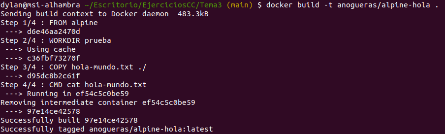
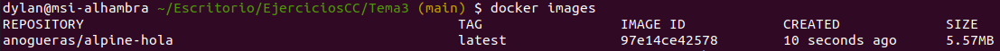
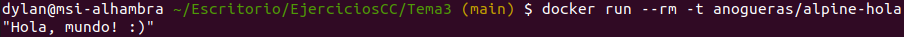

# Ejercicios tema 3 parte 2

## Ejercicio 6

**Reproducir los contenedores creados anteriormente usando un Dockerfile.**

He reproducido el contenedor del [ejercicio 3](https://github.com/aure-nogueras/EjerciciosCC/blob/main/Tema3/ejercicios_tema3_parte1.md). Para ello, he creado *hola-mundo.txt* cuyo contenido es: *"Hola, mundo! :)"*. A continuación, he configurado el *Dockerfile* con el siguiente contenido:

```
FROM alpine
WORKDIR prueba
COPY hola-mundo.txt ./
CMD cat hola-mundo.txt
```

Creo la imagen a partir del *Dockerfile*:



Miro las imágenes actuales con *docker images* para comprobar que se ha creado correctamente:



Por último, creo un contenedor a partir de la imagen y muestro por pantalla el contenido del archivo *hola-mundo.txt*:



## Ejercicio 7

**Usar un miniframework REST para crear un servicio web y introducirlo en un contenedor, y componerlo con un cliente REST que sea el que finalmente se ejecuta y sirve como “frontend”.**

Este ejercicio está [aquí](../Tema6/ejercicios_tema6.md), en el tema 6.
