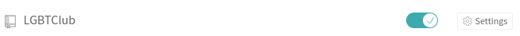
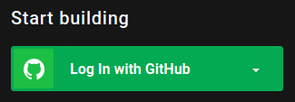
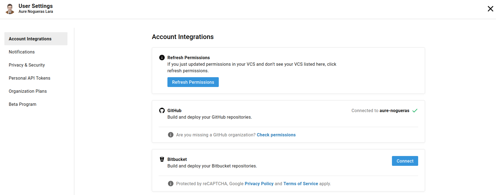
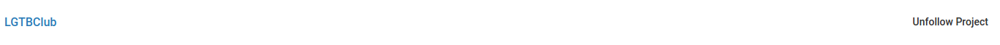
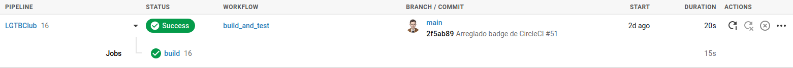

# Ejercicios tema 4

## Ejercicio 1

**1. Darse de alta. Muchos están conectados con GitHub por lo que puedes usar directamente el usuario ahí. A través de un proceso de autorización, acceder al contenido e incluso informar del resultado de los tests.**

Me he metido en *Travis*, donde he accedido a través de mi cuenta de *GitHub*.


**2. Activar el repositorio en el que se vaya a aplicar la integración continua. Travis permite hacerlo directamente desde tu configuración; en otros se dan de alta desde la web de GitHub.**

Sigo los pasos indicados [aquí](https://docs.travis-ci.com/user/tutorial/?utm_source=help-page&utm_medium=travisweb). Primero accedo a los *settings* de mi perfil en *Travis*. Una vez ahí, se despliega una lista con mis repositorios. Selecciono el repositorio correspondiente al proyecto, [*LGBTClub*](https://github.com/aure-nogueras/LGTBClub).



**3. Crear un fichero de configuración para que se ejecute la integración y añadirlo al repositorio.**

Por último, creo el archivo [*.travis.yml*](https://github.com/aure-nogueras/LGTBClub/blob/main/.travis.yml) y lo añado al repositorio. Este es su contenido:

```
language: node_js
node_js:
- "10"
- "12"
install:
- npm install
script:
- grunt test

```

## Ejercicio 2

**2. Configurar integración continua para nuestra aplicación usando Travis o algún otro sitio.**

En el paso anterior he configurado *Travis* para mi aplicación. Por ello, aquí voy a explicar cómo he añadido a mi repositorio [*LGTBClub*](https://github.com/aure-nogueras/LGTBClub) integración continua con *CircleCI*. 

En primer lugar, he accedido a *CircleCI* utilizando mi cuenta de *GitHub*.



En los ajustes puede comprobarse que, efectivamente, el perfil está conectado a *GitHub*.



A continuación, he activado el repositorio del proyecto en el que voy a aplicar la integración continua. En este caso, he accedido a todos mis repositorios desde la pestaña *Projects* y he seleccionado el correspondiente a [*LGTBClub*](https://github.com/aure-nogueras/LGTBClub) integración continua con *CircleCI*.



Por último, he creado una carpeta [*.circleci*](https://github.com/aure-nogueras/LGTBClub/tree/main/.circleci) en mi proyecto, donde he guardado el archivo de configuración [*config.yml*](https://github.com/aure-nogueras/LGTBClub/blob/main/.circleci/config.yml). Este es el contenido de dicho archivo:

```
--- 
jobs: 
  build: 
    docker: 
      - image: anogueras/lgtbclub:latest
        auth:
          username: $DOCKER_HUB_USERNAME
          password: $DOCKER_HUB_PASSWORD
    working_directory: /app
    steps:
      - run: 
          name: Run tests
          command: grunt test
     
version: 2.1
workflows: 
  build_and_test: 
    jobs: 
      - build

```

Con este archivo de configuración, uso la imagen creada en *Docker* para ejecutar los tests creados para la aplicación. Cada vez que hago un nuevo *push* en el repositorio, puedo ver los resultados en *CircleCI*.



