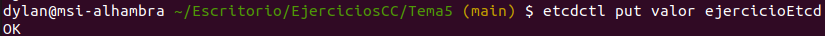
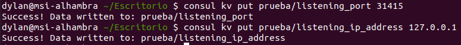
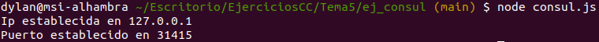

# Ejercicios tema 5 (configuración de microservicios)

## Ejercicio 1

**Instalar etcd3, averiguar qué bibliotecas funcionan bien con el lenguaje que estemos escribiendo el proyecto (u otro lenguaje), y hacer un pequeño ejemplo de almacenamiento y recuperación de una clave; hacer el almacenamiento desde la línea de órdenes (con etcdctl) y la recuperación desde el mini-programa que hagáis.**

Primero he buscado documentación para instalar *etcd3*. 

- [Instalación de *etcd* en Ubuntu](https://tecrobust.com/how-to-install-etcd-on-ubuntu-20-04-lts/).
- [Bibliotecas y herramientas](https://etcd.io/docs/v3.4.0/integrations/).

He ejecutado los siguientes comandos para la instalación:

```
sudo apt-get update -y
sudo apt-get install -y etcd
```

A continuación, dado que estoy utilizando *node.js*, he elegido como biblioteca `microsoft/etcd3`. Para familiarizarme con el almacenamiento y la recuperación de claves, he replicado el ejemplo que aparece [aquí](https://github.com/stianeikeland/node-etcd).  

Después he creado mi propio ejemplo para almacenar la clave desde la consola y recuperarla con [este](./etcd/etcd.js) programa.

```
const { Etcd3 } = require('etcd3');
const client = new Etcd3();

(async () => {
  
  const valor = await client.get('valor').string();
  console.log('El valor recuperado es:', valor);

  await client.delete().all();
})();
```

Como se indica en el material de teoría, antes de utilizar el cliente `etcdctl`, ejecuto `export ETCDCTL_API=3`. Y almaceno *ejercicioEtcd* como valor de prueba:



Por último, ejecuto el programa de prueba para comprobar que el valor se recupera correctamente.


## Ejercicio 2

**Instalar consul, averiguar qué bibliotecas funcionan bien con el lenguaje que estemos escribiendo el proyecto (u otro lenguaje), y hacer un pequeño ejemplo de almacenamiento y recuperación de una clave desde la línea de órdenes.**

He instalado *consul* siguiendo la documentación de su [página](https://learn.hashicorp.com/tutorials/consul/get-started-install?in=consul/getting-started).

Después lo he arrancado usando `consul agent -dev -node machine &` y he añadido un par de valores para las claves:



A continuación, ejecuto el archivo [*consul.js*](./ej_consul/consul.js) para comprobar que los valores se recuperan adecuadamente. Este es el contenido del archivo:

```
const { config }  = require("dotenv").config();
const config_prefix = 'prueba';

class Config {
  constructor() {
    var self = this;
    const consul = require('consul')();
    self.listening_ip_address = process.env.LISTENING_IP_ADDRESS || process.env.OPENSHIFT_NODEJS_IP || '0.0.0.0';
    self.port = process.env.PORT || process.env.OPENSHIFT_NODEJS_PORT || 5000;
    consul.agent.service.list(function(err, result) {
      if (err) {
        console.log( "Consul no está conectado" );
      } else {
        consul.kv.get( config_prefix + '/listening_ip_address',
                     function( err, result ) {
                       if (result != undefined ) {
                         self.listening_ip_address = result.Value;
                         console.log("Ip establecida en " + self.listening_ip_address);
                       }
                     });

        consul.kv.get( config_prefix + '/listening_port',
                     function( err, result ) {
                       if (result != undefined ) {
                         self.port = result.Value;
                         console.log("Puerto establecido en " + self.port);
                       }
                     });
      }
    });

  }
}

const conf = new Config;

module.exports = { Config };
```

Al ejecutarlo, vemos que se recuperan las claves correctamente:


