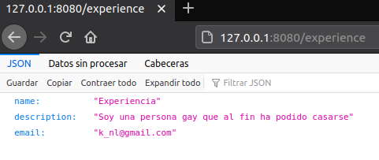
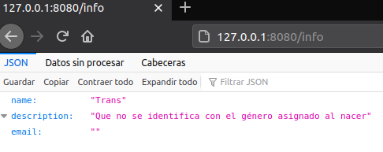
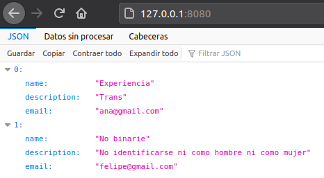
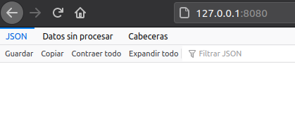
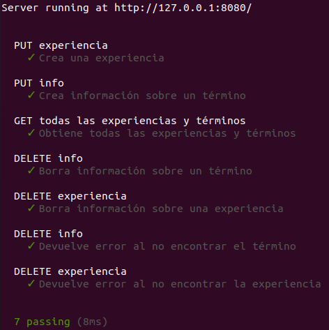

# Ejercicios tema 5 (microservicios)

## Ejercicio 1

**Instalar etcd3, averiguar qué bibliotecas funcionan bien con el lenguaje que estemos escribiendo el proyecto (u otro lenguaje), y hacer un pequeño ejemplo de almacenamiento y recuperación de una clave; hacer el almacenamiento desde la línea de órdenes (con etcdctl) y la recuperación desde el mini-programa que hagáis.**

Primero he buscado documentación para instalar *etcd3*. 

- [Instalación de *etcd* en Ubuntu](https://tecrobust.com/how-to-install-etcd-on-ubuntu-20-04-lts/).
- [Bibliotecas y herramientas](https://etcd.io/docs/v3.4.0/integrations/).

He ejecutado los siguientes comandos para la instalación:

```
sudo apt-get update -y
sudo apt-get install -y etcd
```

A continuación, dado que estoy utilizando *node.js*, he elegido como biblioteca `microsoft/etcd3`. Para familiarizarme con el almacenamiento y la recuperación de claves, he replicado el ejemplo que aparece [aquí](https://github.com/stianeikeland/node-etcd).  

Después he creado mi propio ejemplo para almacenar la clave desde la consola y recuperarla con [este](./ej1/etcd.js) programa.

```
const { Etcd3 } = require('etcd3');
const client = new Etcd3();

(async () => {
  
  const valor = await client.get('valor').string();
  console.log('El valor recuperado es:', valor);

  await client.delete().all();
})();
```

Como se indica en el material de teoría, antes de utilizar el cliente `etcdctl`, ejecuto `export ETCDCTL_API=3`. Y almaceno *ejercicioEtcd* como valor de prueba:


Por último, ejecuto el programa de prueba para comprobar que el valor se recupera correctamente.


## Ejercicio 2

**Realizar una aplicación básica que use algún microframework para devolver alguna estructura de datos del modelo que se viene usando en el curso u otra que se desee. La intención de este ejercicio es simplemente que se vea el funcionamiento básico de un microframework, especialmente si es alguno que, como express, tiene un generador de código. Se puede usar, por otro lado, el lenguaje y microframework que se desee.**

Para este ejercicio he utilizado *node.js* y *express*. Como estructura de datos he seleccionado una clase relacionada con el proyecto que estoy realizando. Dicha clase contiene información sobre términos de la comunidad *LGTB* y experiencias personales. 

Una vez creada la [carpeta](./ej2) que contendrá el código, he usado `npm init` y `npm install express --save` para guardar *express* como dependencia del *package.json*. La carpeta contiene dos archivos: [*InfoAndExperiences.js*](./ej2/InfoAndExperiences.js), que define la estructura de datos mencionada, y [*express.js*](./ej2/express.js), que se usará para probar el funcionamiento de la interfaz REST.

El contenido de *express.js* es el siguiente:

```
#!/usr/bin/env node

var info = require("./InfoAndExperiences.js");

var express=require('express');
var app = express();
var port = process.env.PORT || 8080;

app.get('/info', function (req, res) {
	  var inf = new info("Trans", "Que no se identifica con el género asignado al nacer", "");
    res.send(inf);
});

app.get('/experience', function (req, res) {
		var experience = new info("Experiencia", "Soy una persona gay que al fin ha podido casarse", "k_nl@gmail.com");
    res.send(experience);
});

app.listen(port);
console.log('Server running at http://127.0.0.1:'+port+'/');
```

Ejecuto el comando `node express.js` y me dirijo a la dirección del servidor para comprobar que funciona correctamente.

Como se puede ver en la imagen, para la dirección http://127.0.0.1:8080/experience se obtiene correctamente la experiencia definida.



En el caso de la dirección http://127.0.0.1:8080/info también se obtiene el término definido.




## Ejercicio 3

**Programar un microservicio en express (o el lenguaje y marco elegido) que incluya variables como en el caso anterior.**

Voy a ampliar la aplicación creada en el ejercicio 2 para incluir variables. De este modo, he incluido el controlador de la clase *InfoAndExperiences.js*. El archivo con el que he probado la interfaz REST es [express.js](./ej3y4/express.js):

```
#!/usr/bin/env node

var info = require("./InfoAndExperiences.js");
var infoController = require("./InfoAndExperiencesController.js");
var controller = new infoController();

var express=require('express');
var app = express();
var port = process.env.PORT || 8080;


// Crea una experiencia
app.put('/experience/:name/:description/:email', function (req, res) {
	var nueva_experiencia = new info(req.params.name, req.params.description, req.params.email);
	controller.addInfoAndExperiences(nueva_experiencia);
	res.status(200).send(nueva_experiencia);
});

// Borra una experiencia
app.delete('/experience/:name/:description/:email', function (req, res) {
	var nueva_experiencia = new info(req.params.name, req.params.description, req.params.email);
	if(controller.findInfoAndExperiences(nueva_experiencia) != -1){
		res.status(200).send("Borrado con éxito\n");
		controller.deleteInfoAndExperiences(nueva_experiencia);
	}else{
		res.status(404).send("No existe esa experiencia\n");
	}
});


// Crea un término
app.put('/info/:name/:description/:email', function (req, res) {
	var nuevo_termino = new info(req.params.name, req.params.description, req.params.email);
	controller.addInfoAndExperiences(nuevo_termino);
	res.status(200).send(nuevo_termino);
});

// Borra un término
app.delete('/info/:name/:description/:email', function (req, res) {
	var nuevo_termino = new info(req.params.name, req.params.description, req.params.email);
	if(controller.findInfoAndExperiences(nuevo_termino) != -1){
		res.status(200).send("Borrado con éxito\n");
		controller.deleteInfoAndExperiences(nuevo_termino);
	}else{
		res.status(404).send("No existe ese término\n");
	}
});

// Obtener todas las experiencias y términos
app.get('/', function (req, res) {
	res.send(controller.getInfoAndExperiencesList());
});


app.listen(port);
console.log('Server running at http://127.0.0.1:'+port+'/');
```

Voy a comprobar ahora que funciona de forma adecuada. Para ello, primero utilizo PUT para crear una experiencia y un término nuevos:


Ahora visualizo los datos creados en el navegador con GET:



Por último, borro todo lo creado con DELETE:


Y puedo ver que, efectivamente, el navegador no devuelve ningún elemento si uso el GET de nuevo:




## Ejercicio 4

**Crear pruebas para las diferentes rutas de la aplicación.**

Voy a probar que funcionan correctamente las rutas creadas en el ejercicio 3. Para ello, he creado un archivo [*test.js*](./ej3y4/test/test.js) en la carpeta [*test*](./ej3y4/test). Además, he consultado información sobre el uso de la biblioteca *supertest* [aquí](https://www.npmjs.com/package/supertest).

Este es el contenido de *test.js*:

```
var request = require('supertest'),
app = require('../express.js');

describe("PUT experiencia", function(){
	it('Crea una experiencia', function(done){
		request(app)
			.put('/experience/Experiencia/Soy%20lesbiana/lisa@correo.es')
			.expect('Content-Type',/json/)
			.expect(200,done());
	});
});

describe("PUT info", function(){
	it('Crea información sobre un término', function(done){
		request(app)
			.put('/info/No%20binarie/No%20identificarse%20como%20hombre%20ni%20como%20mujer/rodri@correo.es')
			.expect('Content-Type',/json/)
			.expect(200,done());
	});
});

describe("GET todas las experiencias y términos", function(){
	it('Obtiene todas las experiencias y términos', function(done){
		request(app)
			.get('/')
			.set('Accept', 'application/json')
			.expect('Content-Type',/json/)
			.expect(200,done());
	});
});

describe("DELETE info", function(){
	it('Borra información sobre un término', function(done){
		request(app)
			.delete('/info/No%20binarie/No%20identificarse%20como%20hombre%20ni%20como%20mujer/rodri@correo.es')
			.expect('Content-Type',/json/)
			.expect(200,done());
	});
});

describe("DELETE experiencia", function(){
	it('Borra información sobre una experiencia', function(done){
		request(app)
			.put('/experience/Experiencia/Soy%20lesbiana/lisa@correo.es')
			.expect('Content-Type',/json/)
			.expect(200,done());
	});
});

describe("DELETE info", function(){
	it('Devuelve error al no encontrar el término', function(done){
		request(app)
			.delete('/info/No%20binarie/No%20identificarse%20como%20hombre%20ni%20como%20mujer/rodri@correo.es')
			.expect('Content-Type',/json/)
			.expect(404,done());
	});
});

describe("DELETE experiencia", function(){
	it('Devuelve error al no encontrar la experiencia', function(done){
		request(app)
			.put('/experience/Experiencia/Soy%20lesbiana/lisa@correo.es')
			.expect('Content-Type',/json/)
			.expect(404,done());
	});
});
```

Después de ejecutar los tests usando `npm test`, vemos que todos ellos pasan, con lo que las rutas funcionan adecuadamente.




