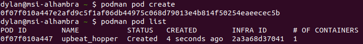
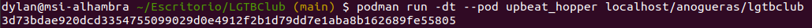
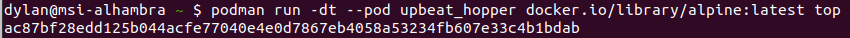
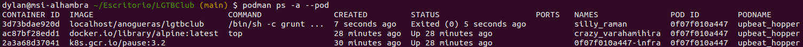
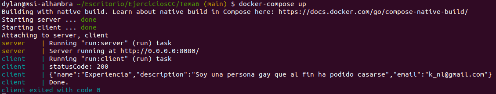

# Ejercicios tema 6 (composición de contenedores)

## Ejercicio 1

**Crear un pod con dos o más contenedores, de forma que se pueda usar uno desde el otro. Uno de los contenedores contendrá la aplicación que queramos desplegar.**

Para documentarme mejor sobre *pod*, he mirado la documentación de [esta página](https://developers.redhat.com/blog/2019/01/15/podman-managing-containers-pods/). Una vez hecho esto, he creado un *pod*:



En la lista se puede ver que el *pod* se llama *upbeat_hopper*. A continuación, he añadido un contenedor con mi proyecto [LGTBClub](https://github.com/aure-nogueras/LGTBClub). Para ello, he construido la imagen a partir del [*Dockerfile*](https://github.com/aure-nogueras/LGTBClub/blob/main/Dockerfile) usando `podman build -t anogueras/lgtbclub .`. Después, he añadido el contenedor:



El siguiente paso ha sido añadir otro contenedor:



Por último, se listan los contenedores del *pod* y vemos que se han añadido correctamente:




## Ejercicio 2

**Usar un miniframework REST para crear un servicio web y introducirlo en un contenedor, y componerlo con un cliente REST que sea el que finalmente se ejecuta y sirve como “frontend”.**

Primero he instalado `docker-compose` siguiendo las instrucciones de la [documentación](https://docs.docker.com/compose/install/#install-compose). A continuación, he consultado [información](https://nodejs.org/en/docs/guides/nodejs-docker-webapp/) sobre cómo crear un contenedor para una aplicación web con *Node.js*. 

Por una parte, he creado un servidor con *express*, que está en la carpeta [*server*](./server). Si se ejecuta el contenedor, se lanza el microservicio en `http://0.0.0.0:8080/`. Por otra parte, la carpeta [*client*](./client) contiene el cliente, que accede a la dirección indicada para realizar una petición GET. Para esta parte se ha utilizado [este tutorial](https://nodejs.dev/learn/making-http-requests-with-nodejs).

Estos dos servicios se han compuesto con el archivo [*docker-compose.yml*](./docker-compose.yml). Este es su contenido:

```
version: '3'

services:
  server:
    container_name: server
    build: ./server
    ports:
      - "8080:8080"
    networks:
      - red
  client:
    container_name: client
    build: ./client
    depends_on:
      - server
    networks:
      - red

networks:
  red:
    driver: bridge
```

He ejecutado `docker-compose up` y comprobado que la composición funciona correctamente:


